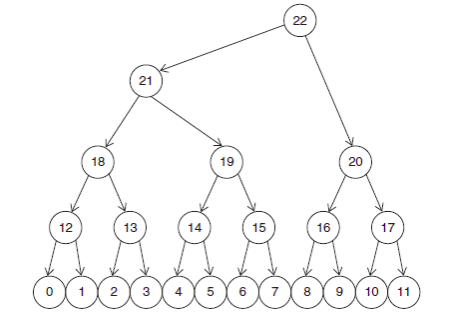
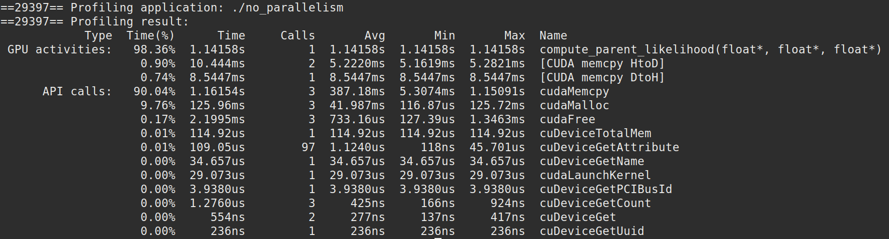
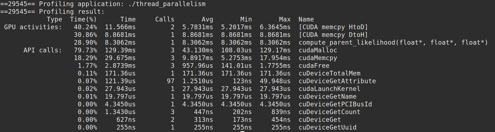
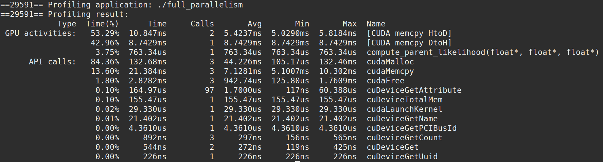

## 1. Parallel Computation of Conditional Likelihood

Done by **S. Pavithra (106118091)** and **V. Aananth (106118103)** for the computer architecture project (Set 5 Question 1).

## Question

With CUDA we can use coarse-grain parallelism at the block level to compute the conditional likelihoods of multiple nodes in parallel. Assume that we want to compute the conditional likelihoods from the bottom of the tree up. Assume that the conditional likelihood and transition probability arrays are organized in memory as described in question 4 and the group of tables for each of the 12 leaf nodes is also stored in consecutive memory locations in the order of node number. Assume that we want to compute the conditional likelihood for nodes 12 to 17, as shown in Figure 1. Change the method by which you compute the array indices in your answer include the block number. 

i. Convert your code from above exercise into PTX code. How many instructions are needed for the kernel? 

ii. How well do you expect this code to perform on a GPU? illustrate your answer in simulation output.



## Answer

#### Simulation Code

- All the `.cu` code, `.ptx` instructions, and the executable files of the simulator can be found in the `./1_Conditional_Likelihood/` folder.

#### Definitions

- In general, the conditional likelihood of a node is defined as the **sum of products of its children's conditional likelihood and their respective transition probabilities**. Mathematically,
	$$
	L(P) =  \sum_{i \in Children} T(P, i) \times L(i) 
	$$
	Where $L(i)$ denotes the conditional likelihood of the $i^{th}$ node and $T(i, j)$ denotes the transition probability from node $i$ to node $j$.

- In our case, since we need to only calculate the conditional likelihood of nodes 12 to 17, we can simplify the above formula. Assumptions:

	- Let the conditional likelihood of the parent nodes $P \in {12 ... 17}$ be stored in an array $clP$ of size $6$ with $clP[0]$ denoting $12$, $clP[1]$ denoting $13$ and so on.

	- Let the conditional likelihood of the child nodes $C \in {0 ... 11}$ be stored in an array $clC$ of size $12$ with $clC[0]$ denoting $0$, $clC[1]$ denoting $1$ and so on.

	- Let the transition probabilities from the parent nodes to the child nodes $T_{ij}$ be stored in an array $tiPC$ of size $12$ with the transition probability between parent $i \in 0 ... 6$ and its child $j \in 0 ... 1$ child be stored at  index $2i + j$. This is possible with an array of size 12 as each child has only one parent (binary tree) and each parent has exactly two children.

- We can derive the following formula,
	$$
	clP[i] = (tiPC[2i] \times clC[2i]) + (tiPC[2i + 1] \times clC[2i + 1])
	$$

#### Solving

- We can see from the above formula for conditional likelihood of each parent that the conditional likelihood of each node is independent of the other and that they require **repeating the same instruction over different sets of data**

- This is a textbook case of **SIMD** parallelism and can be solved on a GPU using the CUDA framework.

- We shall take three different approaches at three different levels of parallelism to solving the problem at hand and evaluate the results.

- We simulate the problem $N = 10^6$ times to obtain consistent results and reduce error. That is, the problem is simulated with $6 \times 10^6$ parent nodes and $12 \times 10^6$ child nodes.

#### Approach 1 - No Parallelism

- We run a single CUDA block with a single CUDA thread to obtain baseline performance.

- We obtain the parent conditional likelihoods by running a for loop over all the parent nodes.

- The CUDA kernel is defined as follows,

	```c
	__global__  void  compute_parent_likelihood (
		float *clP, float *clC, float *tiPC
	) {
		for (int p_id = 1; p_id < 6 * N; p_id++) {
			int l = p_id * 2, r = p_id * 2 + 1;
			clP[p_id] = tiPC[l] * clC[l] + tiPC[r] * clC[r];
		}
	}
	```

- The kernel is called as follows with 1 block and 1 thread,

	```c
	compute_parent_likelihood<<<1, 1>>>(d_clP, d_clC, d_tiPC);
	```

#### Approach 2 - Thread Level Parallelism

- We run a single CUDA block with $T$ threads to solve the problem. Each thread computes the conditional likelihood of $\frac{6N}{T}$ nodes.

- We run a for loop inside each thread starting at node $t \in 0\ ...\ T - 1$ and incrementing index by $T$.

-  A thread with **thread id** $t$ finds the conditional likelihood of nodes $t, t + T, t + 2T$ and so on. In our kernel, the thread id is given by `threadIdx.x`.

- Since we compute $T$ conditional likelihoods simultaneously, **under ideal conditions**, we can expect a $T$-fold increase in performance (speedup) compared to **Approach 1**

- The CUDA kernel is defined as follows,

	```c
	__global__  void  compute_parent_likelihood (
		float *clP, float *clC, float *tiPC
	) {
		for (int p_id = threadIdx.x; p_id < 6 * N; p_id += T) {
			int l = p_id * 2, r = p_id * 2 + 1;
			clP[p_id] = tiPC[l] * clC[l] + tiPC[r] * clC[r];
		}
	}
	```

- The kernel is called as follows with 1 block and $T$ threads,

	```c
	compute_parent_likelihood<<<1, T>>>(d_clP, d_clC, d_tiPC);
	```

#### Approach 3 - Full Parallelism

- We run $B$ CUDA blocks each with $T$ threads to fully parallelise each and every computation. Each thread in a block computes the conditional likelihood of **only one node**.

- The constants $B$ and $T$ are related as
	$$
	B = \lceil \frac{6N}{T} \rceil
	$$
	Where $\lceil x \rceil$ denotes the ceiling function.

- A thread with thread id $t$ inside a block with block id $b$ finds the conditional likelihood of the node with index $bT + t$. In our kernel we can obtain those quantities as follows

	- Block id $b$ : `blockIdx.x` 
	- Thread id $t$ : `threadIdx.x`
	- Number of threads $T$ : `blockDim.x`

- Since we simultaneously calculate the conditional likelihoods of **all** nodes, we can **theoretically** achieve an **infinite speedup** compared to **Approach 1** with this approach. However, due to data and hardware limitations, this is not feasible. We should still achieve a very high speedup with this method.

- The CUDA kernel is defined as follows,

	```c
	__global__  void  compute_parent_likelihood (
		float *clP, float *clC, float *tiPC
	) {
		int p_id = blockIdx.x * blockDim.x + threadIdx.x;
		int l = p_id * 2, r = p_id * 2 + 1;
		
		clP[p_id] = tiPC[l] * clC[l] + tiPC[r] * clC[r];
	}
	```

- The kernel is called with $B$ blocks and $T$ threads as follows,

	```c
	compute_parent_likelihood<<<B, T>>>(d_clP, d_clC, d_tiPC);
	```
#### Execution and Analysis 

- We run the above code using the `nvprof` code profiler to analyse the performance (execution time) of the various approaches.

- We use the results obtained **Approach 1** to be the baseline which the other parallelization approaches are compared against. This is because **Approach 1** is the slowest approach with no parallelization. 

- For simulation purposes we assume the following values
	- $N$ is taken to be $10^6$
	- $T$ is taken to be 256
	- $B$ is taken to be 23428

- We obtain the following results (check below for screenshots)

	|Approach|Expected Speedup|Execution Time | Speedup|
	|-|-|-|-|
	|No Parallelism|1| 1.14s |1|
	|Thread Parallelism|256 (= T)| 8.30ms | 137.34 |
	|Full Parallelism| $\infty$| 763µs | 1494.10 |

- We can see that, accounting for hardware limitations, our results match their theoretical values. The simulation is successful!

#### (a) PTX Code

- The cuda code was converted into PTX instructions using the `nvcc` compiler. Using the `-ptx` flag.

- The number of resulting instructions is as follows,

 	|Approach|Instruction Count|
	|-|-|
	|No Parallelism|71|
	|Thread Parallelism|115|
	|Full Parallelism|29|

- Reading the PTX instructions we can clearly see the effects of compiler optimizations including **loop unrolling** and **compiler prefetching**.

#### (b) Performance of the code in a GPU

- The theoretical performance of the three approaches on a GPU has been explained in their respective sections. The actual simulation results are attached below.

- The following code was profiled on a **Nvidia GeForce 1060 GPU** to obtain the following results
	1. No Parallelism

		
		- We can see that the Kernel function `compute_parent_likelihood` takes 1.14s to execute.

	2. Thread parallelism

		
		- We can see that the Kernel function `compute_parent_likelihood` takes 8.30ms to execute.

	3. Full parallelism

		
		- We can see that the Kernel function `compute_parent_likelihood` takes 763µs to execute.

#### Conclusion

- The given problem was solved by using CUDA to find the conditional likelihood of the parent nodes in parallel.
- Three different approaches were implemented and analysed with respect to eachother.
- The completely parallelised solution was found to achieve a speedup of almost **1500**.
