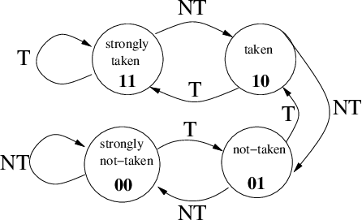
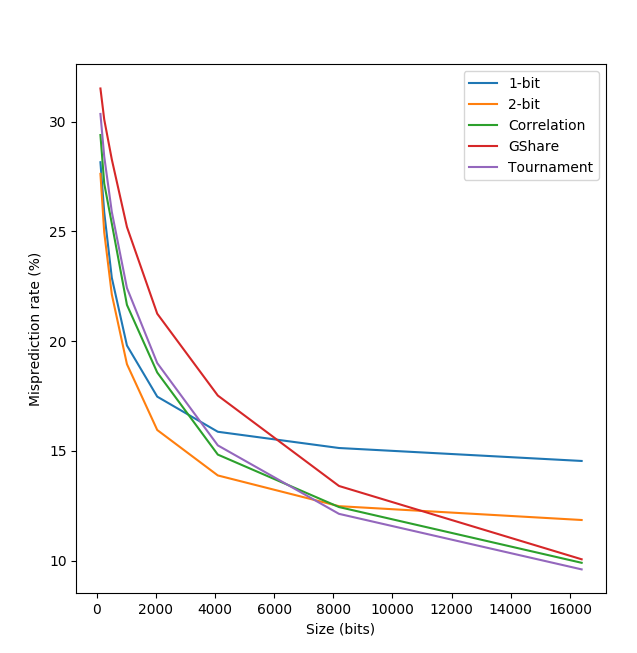
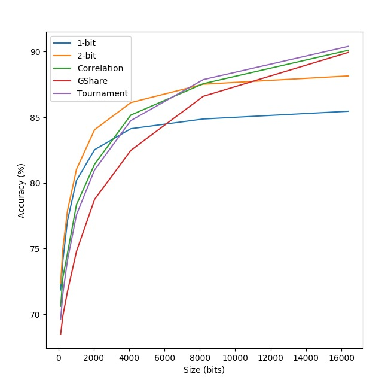
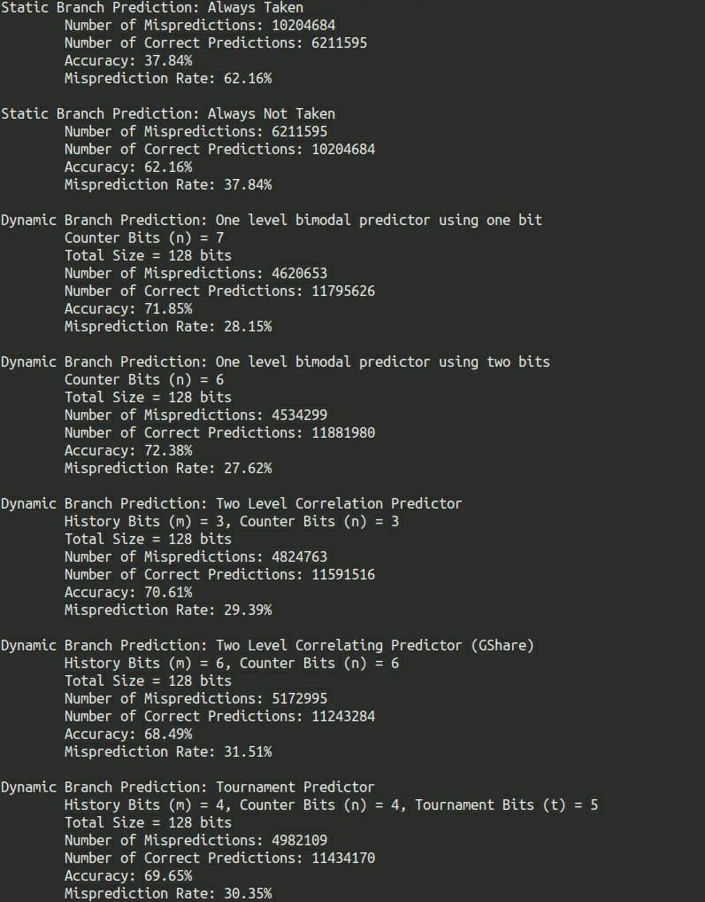
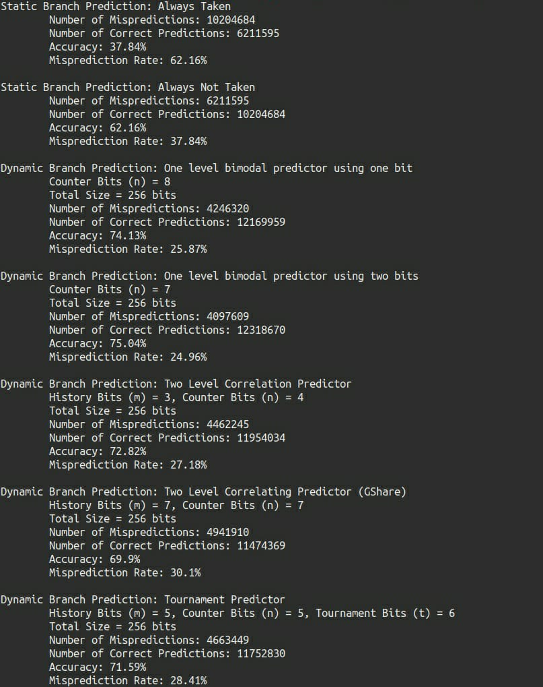
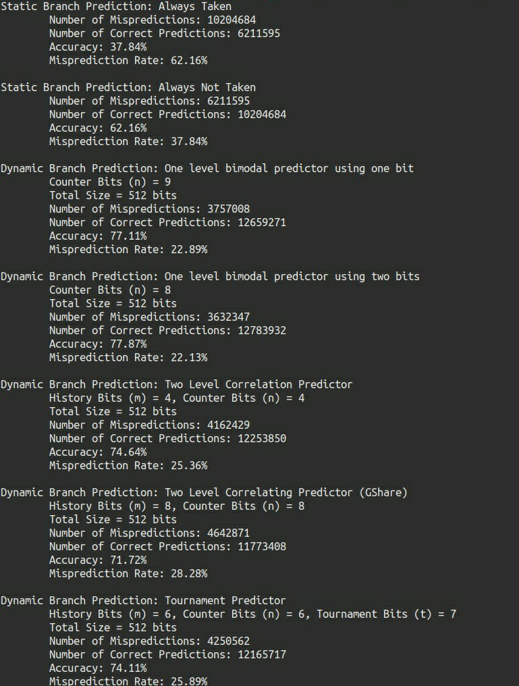
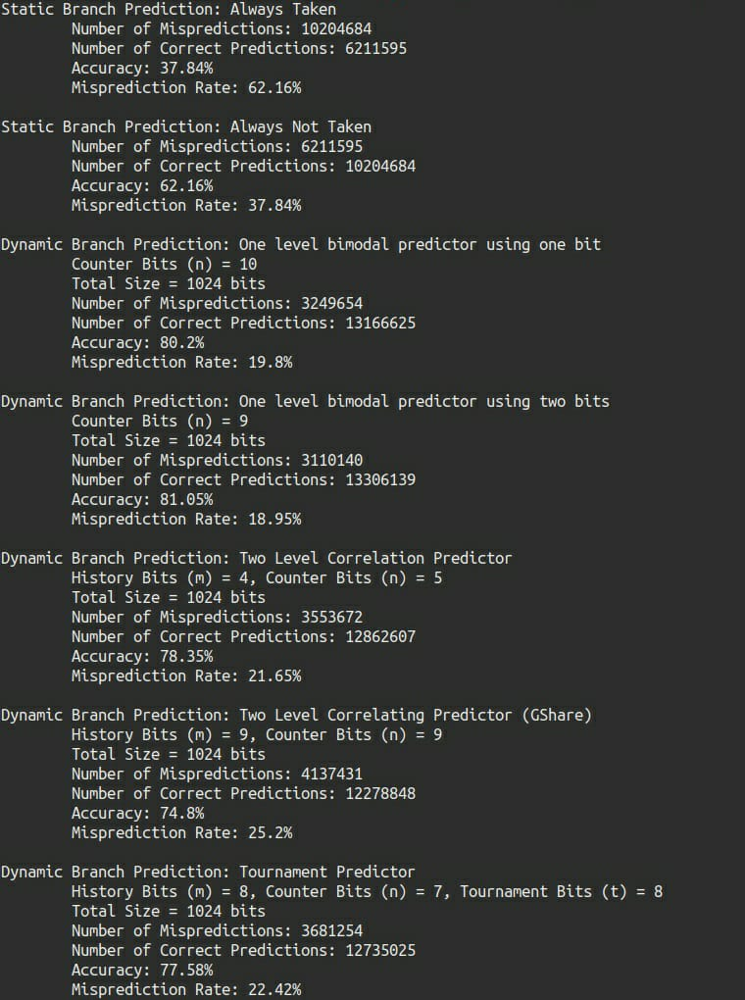
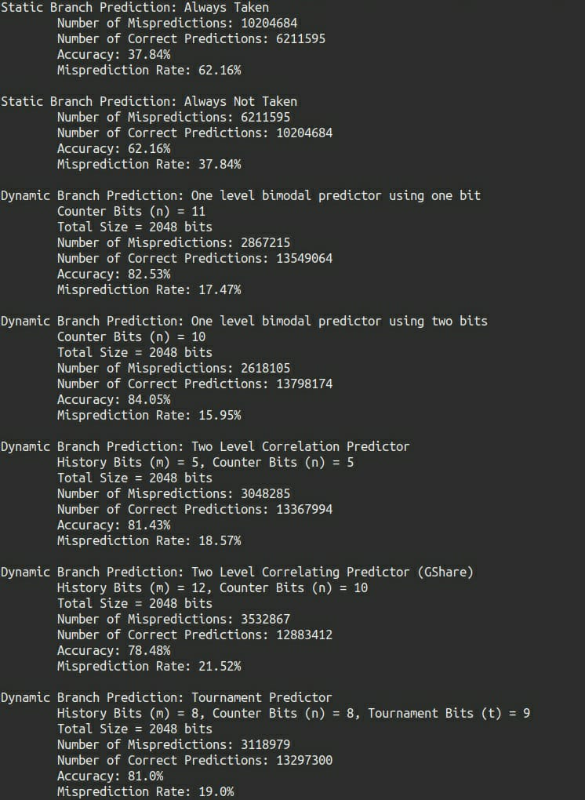
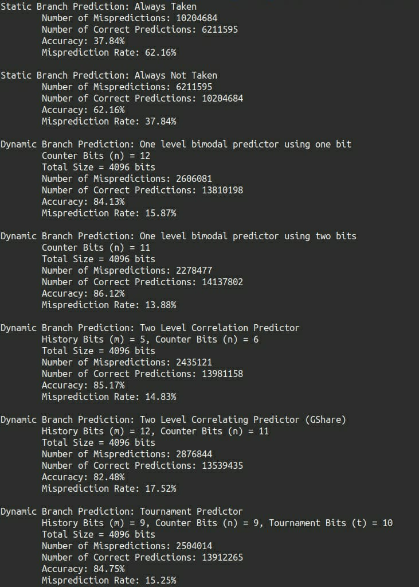
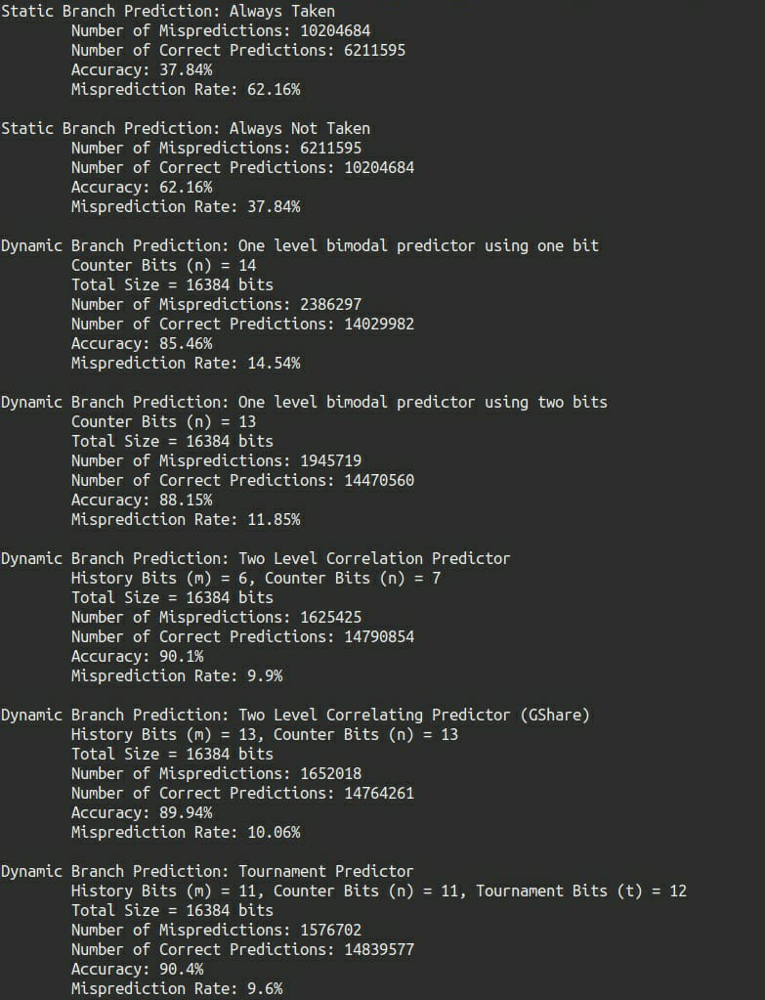

## 3. Implementation of Branch Prediction Schemes

Done by **S Pavithra (106118091)** and **V Aananth (106118103)** for the computer architecture project (Set 5 Question 3).

## Question
Implement Branch prediction methods and analyze the performance

## Answer

### Code

- All the predictors and the code belonging to the simulator, along with sample IO can be found in the `./3_Branch_Predictors` folder.
- To run a simulation we need to execute the following command

    ```bash
    python3 main.py [location of trace file]
    ```

### Simulation

- We have used python to implement the **seven** branch prediction algorithms that are mentioned in the course textbook.

- We then benchmarked the different branch prediction algorithms using the trace obtained by executing the **SPECint2000** benchmark's **gcc** program.

- We also compared the **performance of the algorithms vs their size in memory** and documented the results.

- The trace file we used can be downloaded from https://www.cis.upenn.edu/~milom/cis501-Fall08/homework/hw3/branch-trace-gcc.trace.gz

- The distribution of taken and non-taken branches in the trace are given below.

    | Outcome   |   %  |
    |-----------|------|
    | Taken     | ~38% |
    | Not Taken | ~62% |

### Static Branch Prediction

- Static Branch Prediction in general is a prediction that uses information that was gathered before the execution of the program. 

- We have implemented the following static branch predictors

    1. Branch Always Taken

        - The branch instructions are always predicted to be **taken**. Accuracy of this method will depend on the percent branch taken in the code segment.

    2. Branch Always Not Taken

        - The branch instructions are always predicted to be **not taken**.Accuracy of this method will depend on the percent branch not taken in the code segment.

### Dynamic Branch Prediction

- In the case of dynamic branch prediction, the hardware measures the actual branch behavior by recording the recent history of each branch in a **branch prediction buffer**, assumes that the future behavior will continue the same way and make predictions.

- Dynamic branch prediction changes during the execution of the instructions.

- We have implemented the following Dynamic Branch Predictors:

    1. 1-Bit Predictor

        - The Branch History Table (BHT) or Branch Prediction Buffer stores 1-bit values to indicate whether the branch is predicted to be taken / not taken. 

        - **Prediction**: The lowest $n$ bits of the target address (here ls_bits) index this table of 1-bit values and get the prediction.

        - **Size**: Size of the prediction table is $\times 2^n$ bits. 

        - **Updation of Table**: If the prediction is wrong, the indexed position is updated with the actual outcome of the branch.

        - **Implementation**: Implemented in the `OneBitPredictor` class.

    2. 2-Bit Predictor

        - Two bits are maintained in the prediction buffer and there are four different states namely, **Strongly Taken (11), Weakly Taken (10), Weakly Not-Taken (01) and, Strongly Not Taken (00)**. 

        - This predictor changes prediction only on two successive mispredictions (Strongly taken and weakly taken are interpreted as taken).

        - Table is initialized as strongly not taken (00).

        - **Prediction**: The lowest $n$ bits of the target address (here ls_bits) index the prediction table of 2-bit values and get the prediction. 

        - **Size**: Size of the prediction table is $2 \times 2^n$ bits.

        - **Updation of Table**:  Updation of the bits in the indexed position happens according to the state diagram:

        - **Implementation**: Implemented in the `TwoBitPredictor` class.

            

    3. Correlation Predictor

        - When behavior of one branch is dependent on the behavior of other branches, they are said to be correlated.

        - It uses a **m-bit** history register to record the taken/not-taken history of the last m branches.

        - Table is initialised as strongly not taken (00).
        
        - **Prediction**: Correlating predictor uses the **concatenation** of the $m$ bits of the history register and the lowest $n$ bits of the target address as the index. Rest of the prediction happens similar to 2-bit predictor.

        - **Size**: The size of the branch history table is $2 \times 2^{m + n}$ bits.

        - **Updation of table**: Updation of bits in the branch history table happens similar to the 2-bit predictor scheme. The branch history register is updated by shifting in the most recent conditional branch outcome into the low-order bits.

        - **Implementation**: Implemented in the `CorrelationPredictor` class.

    4. GShare Predictor (GShare)
        - When behavior of one branch is dependent on the behavior of other branches, they are said to be correlated.

        - Gshare uses a **m-bit** history register to record the taken/not-taken history of the last m branches.

        - Table is initialised as strongly not taken (00).

        - **Prediction**: 
            - Gshare uses the lowest $n$ bits of the of the **XOR** between the target address and the $m$ bit history register as the index. 
            - Rest of the prediction happens similar to 2-bit predictor.
        
        - **Size**: The size of the branch history table is $2 \times 2^{n}$ bits.

        - **Updation of table**: Updation of bits in the branch history table happens similar to the 2-bit predictor scheme. The branch history register is updated by shifting in the most recent conditional branch outcome into the low-order bits.

        - **Implementation**: Implemented in the `GSharePredictor` class.

    5. Tournament Predictor
        - This predictor uses the concept of _"predicting the predictor"_ i.e selects the right predictor for a particular branch. In this implementation, three tables are used. 
            - A 2-bit Predictor table to perform 2-bit prediction
            - GShare table to perform gshare prediction
            - Chooser table that predicts whether the 2-bit or gshare predictor will be more accurate

        - So, the chooser is a table of two-bit saturating counters indexed by $t$ low-order bits of the target address (ls_bits) that determines which of the other two table's prediction to return. 

        - For the chooser, the two-bit counter encodes: **strongly prefer 2-bit (00), weakly prefer 2-bit (01), weakly prefer gshare (10), and strong prefer gshare (11)**.

        - Intially, the chooser table is initialized to **strongly prefer 2-bit**.

        - **Prediction**:
            - Access the chooser table using the low-order bits of the branch's target address. 
            - In parallel, the 2-bit and gshare tables are accessed just as normal predictors and they both generate an independent prediction. 
            - Based on the result of the lookup in the chooser table, the final prediction is either the prediction from the 2-bit predictor or the prediction from the gshare predictor.

        - **Size**: The size of the tournament predictor is $2 \times 2^t + 4 \times 2^n$ bits.

        - **Updation of Tables**: 
            - Both the gshare and 2-bit predictors are trained on every branch using their normal training algorithm. 
            - The predictor chooser is trained toward which of the two predictors was more accurate on that specific prediction:
                - If the two predictors make the same prediction either both predictors were correct or both predictors were wrong. In both cases, the chooser table isn't updated.
                - If the two predictors made different predictions (thus, one of the predictors was correct and the other incorrect) the chooser counter is updated (incremented or decremented by one) toward preferring that of the predictor that was correct.

        - **Implementation**: Implemented in the `TournamentPredictor` class.

### Implementation

- All predictor implementations have two important parts

    1. Prediction

        - Done by calling the function ```predict(target_address)``` where target address is the address of the branch instruction.
    
    2. Updation of branch history table

        - Done by calling the function ```update_bht(target_address, actual_outcome, predicted_outcome)```.

### Observation and Inference

- The static branch predictors had a constant accuracy based on the distribution of branches taken and not taken in the trace.

- The five dynamic branch predictors have accuracy / mis-prediction curves of similar shape. The differences between their prediction accuracies are somewhat predictable. Since the performance of static predictor on a program is solely determined by the program's branch behavior, we can conclude that the branch behavior of a program is the most important parameter in determining the prediction accuracy of each scheme.

- The effect of varying the buffer size over five dynamic schemes is given in the graphs below. 

- The curve for the bimodal (1-bit and 2-bit) schemes goes flat when the number of n-bit counters gets above about 6000.  Therefore, for the bimodal scheme, buffer size is not a limiting factor when it is more than 8K bits.

- The common correlation scheme, GShare and Tournament scheme has noticeable improvement in performance with increased buffer size.

- Mis-prediction rate (%) vs Size of predictor:

    |          | 1-bit | 2-bit | correlation | gshare | tournament |
    |:----------|:-----:|:-----:|:-----------:|:------:|:----------:|
    |  128 bits  | 28.15 | 27.62 |    29.39    |  31.51 |    30.35   |
    |  256 bits  | 25.87 | 24.96 |    27.18    |  30.1  |    28.41   |
    |  512 bits  | 22.89 | 22.13 |    25.36    |  28.28 |    25.89   |
    |  1024 bits |  19.8 | 18.95 |    21.65    |  25.2  |    22.42   |
    |  2048 bits | 17.47 | 15.95 |    18.57    |  21.25 |    19.0    |
    |  4096 bits | 15.87 | 13.88 |    14.83    |  17.52 |    15.25   |
    |  8192 bits | 15.13 | 12.48 |    12.44    |  13.4  |    12.13   |
    | 16394 bits | 14.54 | 11.85 |     9.9     |  10.06 |     9.6    |

    {width=320px}

- Accuracy (%) vs Size of predictor:

    |        | 1-bit | 2-bit | correlation | gshare | tournament |
    |:----------|:-----:|:-----:|:-----------:|:------:|:----------:| 
    | 128 bits | 71.85 | 72.38 | 70.61 | 68.49 | 69.65 |
    | 256 bits | 74.13 | 75.04 | 72.82 | 69.9 | 71.59 | 
    | 512 bits | 77.11 | 77.87 | 74.64 | 71.72 | 74.11 | 
    | 1024 bits | 80.2 | 81.05 | 78.35 | 74.8 | 77.58 | 
    | 2048 bits | 82.53 | 84.05 | 81.43 | 78.75 | 81.0 | 
    | 4096 bits | 84.13 | 86.12 | 85.17 | 82.48 | 84.75 | 
    | 8192 bits   | 84.87 | 87.52 | 87.56 | 86.6 | 87.87 | 
    | 16394 bits | 85.46 | 88.15 | 90.1 | 89.94 | 90.4 |

    {width=320px}
    

### Conclusion

Seven different Branch Prediction algorithms were simulated and their performance and accuracy was analysed at different size intervals with respect to each other.

---

### PTO for Sample IO for varying buffer sizes

{height=500px}

{height=500px}

{height=500px}

{height=500px}

{height=500px}

{height=500px}

{height=500px}

{height=500px}